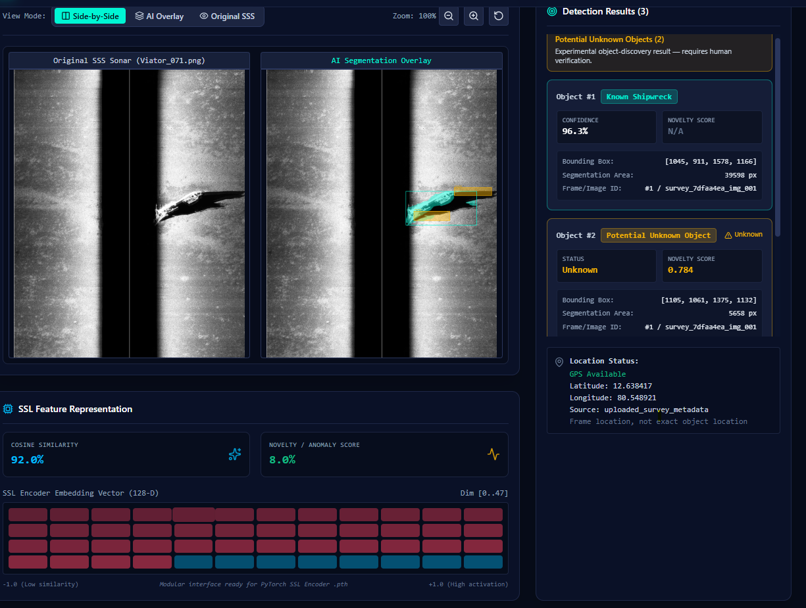

Demo ScreenShorts

Data Preprocessing

Dashboard

Geo-locations

SSS Sonar AI --- Underwater Object Detection & Discovery

Overview

This project is an AI-powered side-scan sonar (SSS) analysis system for
detecting known underwater targets such as shipwrecks and highlighting
regions that may represent previously unseen objects.

The MVP combines:

SSS image preprocessing

Self-supervised learning (SSL) feature representation

SSL-enhanced U-Net segmentation

Known shipwreck detection

Experimental potential-unknown-object discovery

Model-derived confidence and novelty scores

Survey-level sequential processing

Metadata-based geolocation

Interactive image overlays and map visualization

Important: Potential unknown objects are experimental candidates
and require human verification. The system does not automatically
classify a candidate as an artificial object.

1. System Architecture

SSS Survey / Sonar Images
          |
          v
Image Preprocessing
(Normalization / Denoising / CLAHE)
          |
          v
      SSL Encoder
       /       \
      v         v
 SSL-U-Net    SSL Feature Representation
      |               |
      v               v
Known Shipwreck   Candidate Discovery
 Segmentation          |
      |                v
      |         Potential Unknown Objects
      |                |
      +-------+--------+
              |
              v
       Survey Results
          /      \
         v        v
    Dashboard    Map / Geolocation

2. Preprocessing Pipeline

The sonar imagery is processed through image-enhancement stages before
inference:

RAW → Normalization → Denoising → CLAHE

Stage           Purpose

Raw             Original side-scan sonar imagery
Normalization   Places intensity values into a consistent range
Denoising       Reduces unwanted image/acoustic noise
CLAHE           Enhances local contrast and target-related structures

The preprocessing goal is to improve visibility while avoiding
aggressive transformations that could remove small sonar target
features.

3. Self-Supervised Learning

A ResNet18-style encoder is used for self-supervised representation
learning.

The learned representation is integrated into the segmentation pipeline.
An intermediate feature map from encoder.layer4 (e4) is also exposed
for the experimental object-discovery stage and for dashboard
visualization.

Feature visualizations represent neural-network activations/features.
They are not object detections by themselves.

4. Known Shipwreck Detection

The primary supervised task is binary shipwreck segmentation:

Shipwreck vs Background

The trained model is an SSL-enhanced U-Net with a ResNet18-style
encoder.

SSS Image
   ↓
SSL-U-Net
   ↓
Pixel Probability Map
   ↓
Thresholding
   ↓
Shipwreck Segmentation Mask
   ↓
Boundary / Bounding Box

5. Model Performance

The final MVP training run produced these overall validation results:

Metric             Validation

Dice / F1          52.06%
IoU                35.19%
Precision          42.02%
Recall             68.40%
Pixel Accuracy     99.15%

A separate threshold experiment on the individual image Viator_07.png
reached 84.89% Dice at threshold 0.80. This is a single-image result
and must not be reported as the overall model accuracy.

6. Experimental Potential-Unknown-Object Discovery

The supervised model is trained for shipwreck segmentation and therefore
does not inherently recognize arbitrary unknown classes.

The MVP adds an experimental candidate-generation layer using:

Local sonar-image contrast

SSL encoder feature representation

Existing shipwreck probability map

Candidate scoring

Morphological cleanup

Connected-component filtering

Conceptually:

SSS Image
   |
   +--> Local Contrast
   |
   +--> SSL Features
   |
   +--> Shipwreck Probability
             |
             v
      Suppress known mask
             |
             v
       Candidate Regions
             |
             v
      Connected Components
             |
             v
 Potential Unknown Objects

The current candidate score is:

Candidate Score = 0.5 × Contrast + 0.5 × SSL Novelty

This is an experimental heuristic. It identifies regions that appear
unusual according to the current image and representation, but it does
not prove that a region is artificial or identify its class.

The UI therefore uses:

Potential Unknown Object

with:

Experimental object-discovery result --- requires human
verification.

Unknown candidates use confidence = null and retain the candidate
novelty score.

7. Known vs Unknown Results

Known and unknown results intentionally use different score semantics.

Known

{
  "class_name": "shipwreck",
  "status": "known",
  "confidence": 0.963,
  "novelty_score": null
}

Potential unknown

{
  "class_name": "unknown_object",
  "status": "unknown",
  "confidence": null,
  "novelty_score": 0.783666
}

The known-object confidence is a model-derived score and has not been
presented as a calibrated probability.

The novelty score is an experimental anomaly/novelty score, not a
probability that an object is artificial.

8. Geolocation

Geolocation is implemented as a metadata-driven layer rather than being
predicted by the image model.

SSS Frame
   +
Survey Navigation Metadata
   ↓
Frame ↔ Navigation Matching
   ↓
Latitude + Longitude
   ↓
Detection / Survey Map

Expected metadata fields can include:

filename
latitude
longitude
timestamp
heading

Demo navigation data

If synthetic Bay of Bengal coordinates are used for the MVP, they must
be explicitly labelled:

Demo Navigation Data

They must not be represented as the actual capture locations of the
AI4Shipwrecks images.

For deployment, the demo coordinates should be replaced by real survey
navigation/GPS data.

Frame vs exact object location

If only the sonar frame's GPS position is available, the displayed
coordinate represents:

Frame location, not exact object location

Exact object-level georeferencing requires sufficient survey geometry,
potentially including vessel GPS, heading, sonar range, orientation,
ping position, and sonar mounting information.

9. Dashboard

The application provides:

Survey upload

Multiple-image processing

Sequential analysis

Processing progress

Known shipwreck count

Potential unknown-object count

Original SSS image

AI segmentation overlay

Known-object boundaries

Potential unknown-object boundaries

Bounding boxes

Segmentation area

Frame/Image ID

Known confidence score

Unknown novelty score

SSL feature representation

Survey map

Geolocation when metadata is available

10. Image Analysis View

The interface provides side-by-side visualization:

+----------------------+----------------------+
| Original SSS Sonar   | AI Segmentation      |
|                      | Overlay              |
+----------------------+----------------------+

Detection details include:

Object ID
Class
Status
Confidence / Novelty
Bounding Box
Segmentation Area
Frame/Image ID
Location

Known and potential-unknown boundaries are visually distinguished.

11. Map View

The map can display:

Survey track

Known shipwreck detections

Potential unknown detections

Latitude

Longitude

Frame/Image ID

Selecting a detection shows its metadata.

Example:

Known Shipwreck

Object ID: known-1
Class: shipwreck
Status: known
Confidence: 90.0%

Latitude: 12.345678
Longitude: 80.123456

Frame location, not exact object location

If no valid metadata exists, the UI displays:

Location data unavailable

The system must never use 0,0 or invented coordinates as a fallback.

12. Backend

The backend is implemented with FastAPI.

Representative API endpoints:

POST /api/logs/upload
GET  /api/logs
GET  /api/logs/{log_id}
POST /api/logs/{log_id}/analyze
GET  /api/logs/{log_id}/status
GET  /api/logs/{log_id}/results
GET  /api/logs/{log_id}/images
GET  /api/logs/{log_id}/images/{image_id}
GET  /api/logs/{log_id}/detections
GET  /api/health

The application uses the real PyTorch inference provider when the
trained SSL-U-Net checkpoint is available. A mock provider is retained
for application-level testing.

13. Survey Processing

Survey images are processed sequentially:

Survey Upload
     ↓
Image 1 → Inference
     ↓
Image 2 → Inference
     ↓
Image 3 → Inference
     ↓
Survey Results

The dashboard reports processing progress and summarizes:

Total images

Known detections

Potential unknown objects

Images containing known detections

Images containing potential unknowns / requiring human review

14. Data Sources

AI4Shipwrecks

Used for the supervised shipwreck segmentation task.

China-Offshore-SSS-AI

Used as additional SSS imagery for experimentation and domain/robustness
testing.

A prediction on an image from a different dataset/domain is not
ground-truth validation unless an appropriate label exists.

16. MVP Demonstration Flow

Upload SSS Survey
       ↓
Show preprocessing
       ↓
Start survey processing
       ↓
Show progress
       ↓
Show known shipwreck detection
       ↓
Show segmentation boundary
       ↓
Show potential unknown object
       ↓
Show novelty score
       ↓
Show SSL feature representation
       ↓
Show survey summary
       ↓
Show geolocation on map

The main project message is:

Supervised shipwreck segmentation + experimental SSL-based object
discovery + metadata-driven geospatial visualization for side-scan
sonar surveys.

17. Terminology and Responsible Interpretation

Preferred term                      Avoid

Known Shipwreck                     Guaranteed shipwreck

Potential Unknown Object            Artificial Object

Novelty Score                       Probability of artificial object

Model-derived Confidence            Calibrated probability

Frame Location                      Exact Object Location

Demo Navigation Data                Real GPS Location

18. Future Work

Larger multi-environment SSS pretraining

More labeled data

Hard-negative mining

Improved false-positive suppression

Confidence calibration

Dedicated open-set/unknown-object detection

Exact object-level SSS georeferencing

Real-time survey processing

Automated sonar mosaicking

Multi-class underwater object recognition

Human-in-the-loop candidate verification

Integration with real vessel navigation systems

Conclusion

The MVP demonstrates an end-to-end intelligent side-scan sonar analysis
workflow:

Preprocessing → SSL Representation → Shipwreck Segmentation →
Experimental Unknown-Object Discovery → Metadata Geolocation →
Interactive Dashboard

The system is intended as a decision-support tool. Known detections
should be evaluated using the reported model metrics, while potential
unknown objects require human review before identification or
classification.